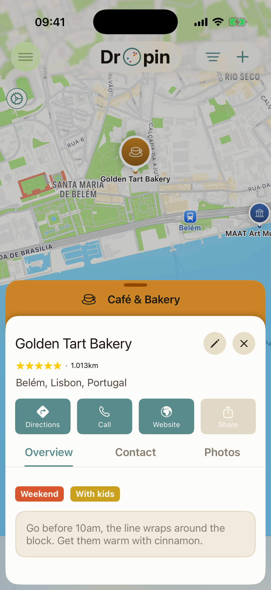
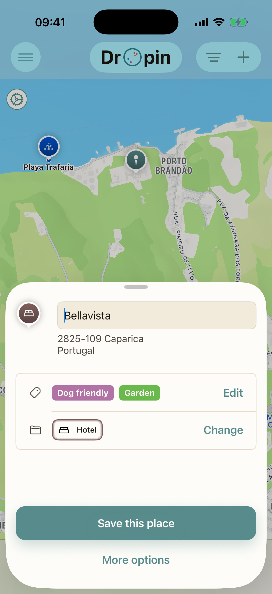
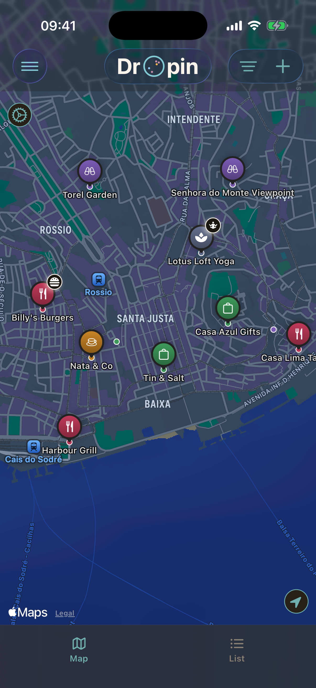
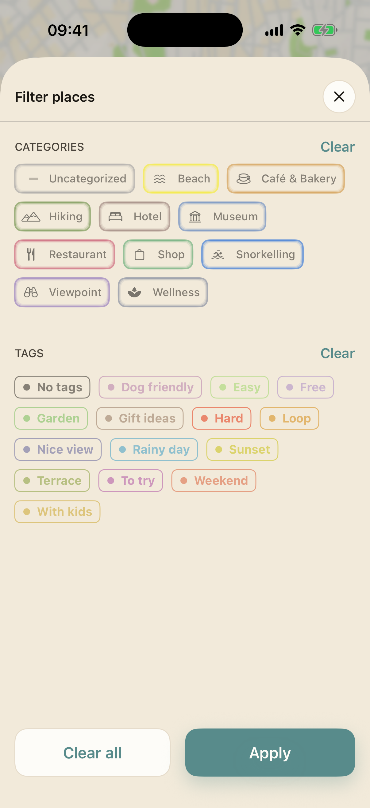
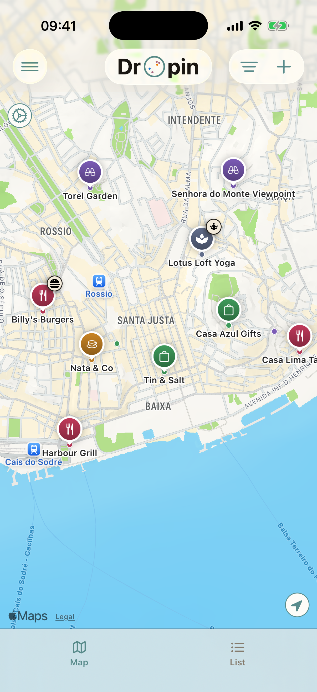
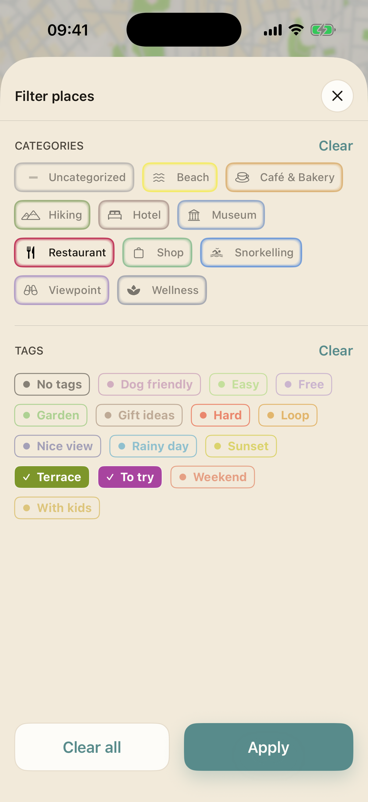
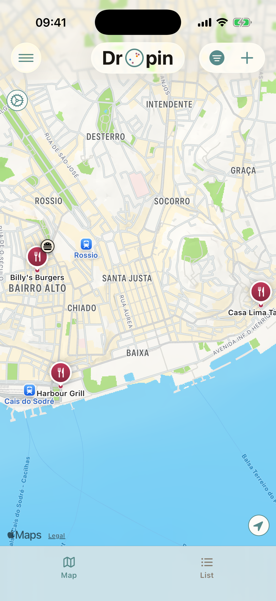

# Dropin

An iOS app for building your own map of the places that matter to you.

Dropin is in development and not on the App Store yet.

  
  
  
  

## What it does

- **Save a place in seconds.** Long press the map to drop a pin, give it a name and a category. You can also start from an address, your current location or GPS coordinates.
- **Categories and tags.** Each place has one category, with its own color and symbol, and as many tags as you want.
- **Your own details.** Rating, notes, photos, phone, email and website on every place.
- **Filter the map.** Select categories and tags, and the map only shows the places that match.
- **Map and list.** Pins are displayed on the map or listed.
- **Directions.** Open any place in Apple Maps, Google Maps or Waze.
- **Import from Mapstr.** Places arrive with their tags and icon, this is mapped into Dropin logic.
- **Export anytime.** Export your whole library to a readable Dropin file and import it back on any device.
- **Works offline.** Your places are stored on the device.
- **Light and dark mode.**

## Built with

- SwiftUI
- SwiftData for local storage
- MapKit
- Supabase for remote sync

## Architecture

Dropin follows Clean Architecture with MVVM in the presentation layer.

### Layers

- **Domain**: entities, use cases and repository protocols. Pure Swift, no framework dependencies.
- **Data**: repository implementations and SwiftData persistence.
- **Network**: remote sync and API clients.
- **UI**: SwiftUI views and their view models.
- **Core**: The app itself, shared utilities, extensions and design tokens (colors, fonts).

### Patterns

- **Coordinators** handle navigation, so views don't know about each other.
- **Dependency injection** gives each view model only what it needs, such as repositories, services and use cases. 

## Coming next

- Shared place links that open on the web, for people who don't have the app
- TestFlight beta

## Screenshots

| Map | Quick create | Place |
|-----|--------------|-------|
|  |  |  |

### Filtering

| No filter | All places | Filter on | Matching places |
|-----------|------------|-----------|-----------------|
|  |  |  |  |

## Author

Baptiste Sansierra, Barcelona.

